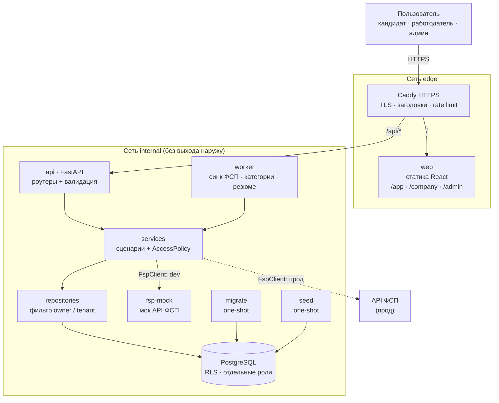

# План: агрегатор ИТ-вакансий с подтверждённым профилем (ФСП)

Обратная механика: кандидаты автоматически попадают в категории по проверяемым данным ФСП,
работодатель выбирает категорию -> выходит на конкретного кандидата с вакансией и зарплатой.

## 1. Принципы (экономия токенов и ресурсов)
- Один язык на бэке (Python), один на фронте (TS). PostgreSQL заменяет Redis, очередь и полнотекстовый поиск.
- Лёгкие образы: python:3.12-slim, postgres:16-alpine, node только для сборки, фронт - статика через Caddy.
- Без torch/GPU. Матчинг: правила + BM25/TF-IDF (scikit-learn, pg_trgm). Эмбеддинги - только если останется время.
- Multi-stage сборка, кэш pip/npm, `.dockerignore`: зависимости ставятся один раз.
- Работа по фазам, коммит на каждой. Наращиваем, не переписываем.

## 2. Архитектура
(схема также в `docs/architecture.md`, исходник `docs/architecture.mmd`)



Сети: `edge` (caddy, web, api) и `internal` (`internal: true`: db, fsp-mock, а также api/worker). В проде api и worker дополнительно подключаются к сети `egress` только ради запросов к реальному API ФСП; БД и мок наружу не выходят и порты не публикуют.

Стек: FastAPI, SQLAlchemy 2 async, Alembic, Pydantic v2, argon2-cffi, PyJWT, slowapi, pypdf/python-docx.
Фронт: Vite + React + TS, TanStack Query, React Router, Tailwind, Motion, react-hook-form + zod.
Контракт: OpenAPI из FastAPI -> типы фронта генерируются (openapi-typescript).
Тесты: pytest+httpx, Vitest, один Playwright smoke. CI: lint, тесты, gitleaks, pip-audit, npm audit, trivy, jscpd.

## 3. Домен и логика
Роли: `candidate`, `employer` (owner/recruiter), `admin` (moderator/superadmin).

**Кандидат**: регистрация -> профиль (стек, грейд, роль, формат, город, вилка) -> привязка ФСП (одноразовый код / OAuth-заглушка в моке)
-> достижения -> автокатегоризация.
**Категория** = дисциплина ФСП x уровень (разряд/место) x роль x стек x грейд; считается детерминированно в worker.
Тир подтверждения: `verified_fsp` > `resume_parsed` > `self_declared` - работодатель его видит.
**Работодатель**: регистрация компании (модерация) -> вакансии (вилка обязательна) -> каталог категорий -> анонимные карточки -> оффер.
**Приватность**: кандидат виден анонимно; имя и контакты открываются только после принятия оффера. Можно скрыться, отозвать согласие, удалить аккаунт (152-ФЗ).
**Матчинг (0..100)**: навыки 40, грейд 20, достижения ФСП 20, формат/город 10, вилка 10; возвращаем вклад каждого фактора.
**Резюме**: PDF/DOCX <=5 МБ, проверка magic bytes, словарь навыков, без LLM. **Квиз** по стеку - минимальный, опционально.

## 4. Данные
users, candidate_profiles, employer_companies, company_members, vacancies, skills, profile_skills, fsp_links,
fsp_achievements(discipline, competition, result, role, rank, date, raw_hash), categories, candidate_categories,
offers(sent/accepted/declined/expired), contact_reveals, resumes, passports, refresh_tokens, audit_log, salary_stats.
UUID везде. Индексы: GIN по навыкам, pg_trgm, составные (category, grade).

## 5. API (/api/v1)
- auth: register, login, refresh, logout, verify-email, me, 2fa (admin)
- candidate: profile, resume, fsp/link, fsp/sync, offers, offers/{id}/accept|decline, passport, growth-path, salary-radar
- employer: vacancies CRUD, categories, candidates?category=, candidates/{anon_id}, offers, members
- admin: companies/vacancies moderation, users, dictionaries CRUD, audit, sync status, complaints
- public: health, categories (агрегаты), passport/verify/{id}
Единый формат ошибок, курсорная пагинация, Idempotency-Key для оффера.

## 6. Безопасность (блокирует коммит в main)
**Секреты**: только `.env` (в .gitignore), в репо `.env.example` без значений; на сервере Docker secrets / файлы 0600.
gitleaks в pre-commit и CI, проверка истории перед push. Ключи не попадают в логи, URL и внешние сервисы. Всё вставленное в чат считать раскрытым - ротировать после хакатона.
**БД**: отдельный пользователь приложения (без SUPERUSER/CREATE) и отдельный для миграций; пароль >=32 символов; порт не наружу;
Row Level Security как вторая линия; контакты шифруются на уровне приложения (AES-GCM, ключ из секретов); шифрованные бэкапы pg_dump.
**Изоляция пользователей**: все запросы идут через репозиторий с обязательным фильтром owner/company; UUID; `anon_id` не связан с user_id;
автотесты IDOR на каждый эндпоинт (A не читает/меняет данные B); контакты только при `offers.status=accepted`.
**Аутентификация**: argon2id, одинаковые ответы на неверный логин/email, задержка при переборе; access JWT 10-15 мин в памяти,
refresh в httpOnly+Secure+SameSite=Strict cookie с ротацией и отзывом при повторном использовании; CSRF; строгий CORS.
**Транспорт/приложение**: HTTPS, HSTS, CSP без inline, nosniff, Referrer/Permissions-Policy; rate limit на auth и поиск; лимиты тела;
валидация Pydantic; ORM-параметры; загрузки: тип, размер, вне веб-корня.
**Контейнеры**: non-root, read_only, cap_drop ALL, no-new-privileges, лимиты CPU/RAM, healthchecks, pinned версии. Аудит-лог критичных действий.

## 7. ООП и отсутствие дублирования
Слои бэка: `api (роутеры, только HTTP) -> services (сценарии) -> repositories -> models`.
- **BaseRepository[T]** (generic): CRUD, пагинация, фильтр владельца/тенанта - один раз; наследники добавляют только своё.
- **Интерфейсы + подмена реализаций**: `FspClient` (Mock/Http), `ResumeParser` (Pdf/Docx), `Notifier` (Email/Telegram), `Storage` (Local/S3).
- **Strategy**: `ScoringFactor` (Skills/Grade/Fsp/Salary...), `CategoryRule` - новое правило = новый класс, остальное не трогаем.
- **AccessPolicy** - единственная точка решения «может ли X сделать Y с Z»; роутеры вызывают только её.
- DI через FastAPI Depends (тесты подменяют зависимости), единые schemas, обработчик ошибок, логгер, `config` (pydantic-settings).
- Фронт: сгенерированный API-клиент, хуки по фичам, UI-kit один раз.
- CI: ruff, mypy, jscpd (дубли), покрытие.

## 8. Доступы: кандидат, работодатель, админ
Один фронтенд-проект, три лениво загружаемых портала: `/app`, `/company`, `/admin`. Бэк: `/candidate|employer|admin`, права - `AccessPolicy` (RBAC + владелец).

| Действие | Кандидат | Работодатель (owner/recruiter) | Админ (moderator/superadmin) |
|---|---|---|---|
| Свой профиль, ФСП | полный | - | чтение по основанию, в аудите |
| Анонимный каталог | - | да (recruiter+) | да |
| Контакты кандидата | свои | только после accepted-оффера | только break-glass с причиной, в аудите |
| Вакансии | просмотр | CRUD своей компании | модерация, блокировка |
| Офферы | принять/отклонить | создать/отозвать | просмотр для жалоб |
| Члены компании | - | owner управляет recruiter | - |
| Справочники (навыки, дисциплины, правила) | - | - | CRUD |
| Пользователи, блокировки, жалобы | - | - | да |
| Синк ФСП, задачи | свой sync | - | да |
| Метрики, аудит | - | своя статистика | полная |

Админка: обязательная 2FA (TOTP), отдельные cookie/сессия, короткий срок, опционально IP-allowlist в Caddy,
первый суперадмин создаётся CLI-командой, действия superadmin пишутся в неизменяемый аудит.

## 9. Конкуренты и изюминка
Плюсы/минусы по открытым обзорам ([обзор на Хабре](https://habr.com/ru/articles/932990/): конверсия отклика hh в ответ <1%, «вакансии-призраки» на LinkedIn); остальное - общеизвестные наблюдения, перед защитой проверить.
| Площадка | Берём | Убираем |
|---|---|---|
| hh.ru | огромная база, привычка, фильтры | универсальность, шум, отклик вслепую и без ответа |
| Хабр Карьера | ИТ-аудитория, зарплатные вилки | слабая верификация навыков, мало пользы после регистрации |
| GetMatch | ИТ-фокус, оффер-подход, зарплата в вакансии | узкая выдача, нет подтверждения компетенций |
| LinkedIn | сеть, бренд, международность | вакансии-призраки, шум рекрутеров, платные функции, нет проверки навыков |

**Главная изюминка - «Паспорт навыков»**: резюме, подтверждённое данными ФСП. Вокруг него:
1. **Проверяемый паспорт** - публичная ссылка/PDF с QR и подписью (хеш); работодатель на любой площадке проверяет подлинность. Наш сервис - «источник правды» кандидата.
2. **Радар зарплат** - «сколько стоит твоя категория» по реальным офферам платформы, только группы >=5 человек (k-анонимность).
3. **Путь роста** - «до Senior Backend (Go) не хватает X и Y; ближайшие соревнования ФСП...»; замыкает цикл с ФСП.
4. **Честный найм** - вакансия живёт 14 дней (потом подтвердить или закрыть), оффер обязан содержать вилку, у работодателя публичный рейтинг отклика; кандидат не рассылает отклики вслепую.
Плюс «тихий режим»: офферы только от проверенных компаний.
MVP: обязательно 1 и 4; 2 на демо-данных; 3 если хватит времени.

## 10. Дизайн
- Основа - брендбук ФСП (когда пришлют); пока нейтральная тёмная тема, токены цветов в CSS-переменных.
- Scrolltide (~$239) и MotionSites - платные библиотеки промптов; платить не нужно, берём как референс и делаем на Motion + CSS.
- Скиллы (frontend-design, ux-ui-agent-skills, impeccable, taste-skill, motion-framer): сначала читаю SKILL.md и скрипты, ставлю один раз на уровень проекта, без сетевых/shell-хуков. То же для jev-skill-suggestion.
- Анимации на transform/opacity, `prefers-reduced-motion`, ленивая загрузка страниц, WCAG AA.
- Экраны: лендинг (2 аудитории), вход, кабинет кандидата (профиль, паспорт, радар, путь роста, офферы), кабинет работодателя (вакансии, каталог, карточка, офферы), админка.

## 11. Docker: модульно и переносимо
Каждый сервис - свой Dockerfile и свой compose-файл; поднимается любая комбинация.
```
deploy/
  compose.base.yml      # сети, тома, общие x-anchors (healthcheck, security_opt, лимиты)
  compose.db.yml  compose.api.yml  compose.worker.yml
  compose.fsp-mock.yml  compose.web.yml  compose.proxy.yml
  compose.dev.yml       # hot reload, порты на 127.0.0.1
  compose.prod.yml      # лимиты, restart, без dev-портов
```
Makefile: `make up S="db api"`, `make down S=web`, `make logs S=api`, `make prod`, `make test`. Общие настройки один раз в base.
Перенос: `git clone` -> заполнить `.env` -> `make prod`; миграции при старте api. Сервер: 1 vCPU / 1-2 ГБ RAM, бэкап по cron.
Docker на вашем Mac нужно проверить (из моего окружения не виден).

## 12. Фазы и Git
0. Каркас: README, .gitignore, .env.example, compose, CI (первый коммит по вашей инструкции).
1. Бэк: auth, модели, миграции, RLS, AccessPolicy, тесты IDOR.
2. fsp-mock + интеграция + категоризация + паспорт.
3. Кабинеты, офферы, раскрытие контактов, админка.
4. Матчинг, резюме, радар зарплат, путь роста.
5. Фронт: дизайн-система, три портала, анимации.
6. Аудит безопасности, smoke-нагрузка, документация API, инструкция деплоя, демо-данные.
Push на GitHub только по вашей команде и после проверок (gitleaks, тесты, аудит зависимостей). Ветки feature/*, в main через squash.

## 13. Статус вопросов
- Спецификация/мок API ФСП и брендбук: пока нет — делаем свой мок и нейтральную тему, подменим, когда появятся.
- Команда: 3 человека (2 разработчика + системный аналитик).
- Деплой: пока локально; сервер (VPS) — ближе к концу.
