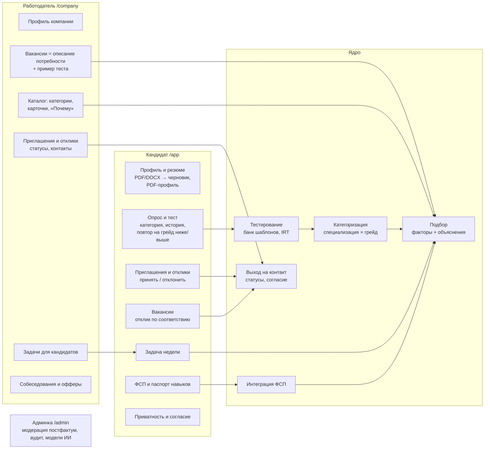
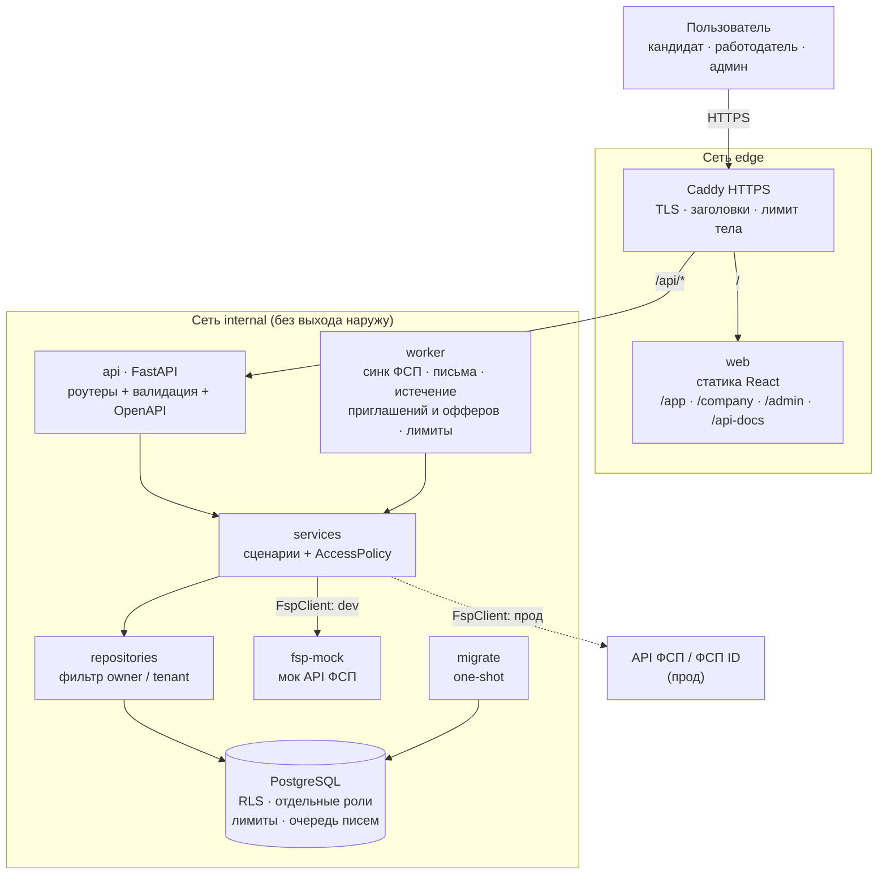

# Архитектура

## Функциональная архитектура

## Компонентная архитектура

Монолит с явными слоями и слабо связанными модулями: `api` (HTTP) → `services` (сценарии и права) →
`repositories` (запросы с фильтром владельца) → `models`. Модули предметной области:

| Модуль | Код | Документ |
|---|---|---|
| Тестирование и категории | `services/assessment/`, `services/specializations.py` | [assessment.md](assessment.md) |
| Подбор и каталог | `services/matching/`, `services/catalog.py` | [matching.md](matching.md) |
| Выход на контакт | `services/applications/`, `services/vacancy_board.py` | [matching.md](matching.md) |
| Задачи от работодателей | `services/tasks.py` | [assessment.md](assessment.md) |
| ФСП и паспорт навыков | `services/fsp*.py`, `services/passport.py`, `integrations/fsp.py` | [integrations.md](integrations.md) |
| Резюме и автозаполнение | `services/resume/`, `services/profile_import.py` | [integrations.md](integrations.md) |
| Собеседования и офферы | `services/interviews/`, `services/offers.py` | [api.md](api.md) |
| Процедура оценки | `app/evaluation/` (`make evaluate`) | [validation.md](validation.md) |

Каждый сервис компоуза запускается отдельно (`make up S="db api"`), api и worker — один образ.
Данные пользователей защищены дважды: фильтром репозитория и Row Level Security в PostgreSQL
([data.md](data.md)).
