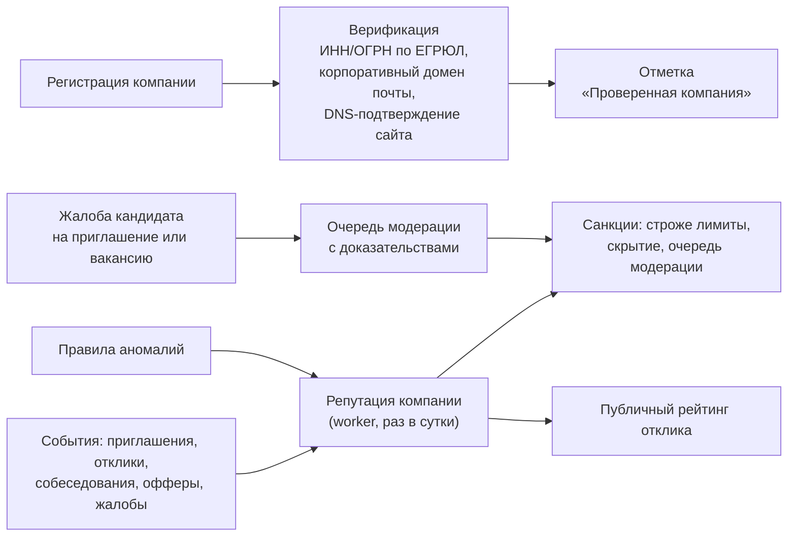
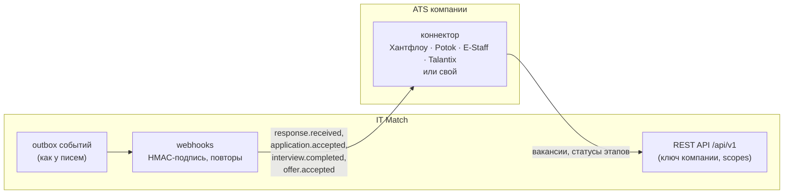

# Концепции за рамками MVP: защита от недобросовестных работодателей и интеграция с ATS

ТЗ ждёт здесь не реализацию, а архитектурный подход для доработки вместе с ФСП. Ниже — что уже есть
в коде как основа и что предлагается сверху.

## 1. Защита от фиктивных вакансий и недобросовестных работодателей

### Уже работает

| Мера | Где |
|---|---|
| Подтверждение почты при регистрации, согласие кандидата на передачу контактов | `services/account.py`, приглашения |
| Обязательная вилка «от–до» в вакансии и приглашении | схемы `SalaryRangeMixin`, `InvitationIn` |
| Контакты кандидата — только после его согласия, каждое раскрытие в журнале | `applications`, `contact_reveals`, аудит |
| Лимиты: 100 приглашений в сутки, пауза 30 дней после отказа, одно открытое обращение на пару | `core/ratelimit`, `services/applications` |
| Вакансия живёт 14 дней, потом продлевается или закрывается («призраки» не висят) | `vacancies.expires_at`, RLS |
| Модерация постфактум: блокировка компании, вакансии, пользователя с причиной | `/admin`, аудит |
| Премодерация компаний включается одной переменной | `COMPANY_PREMODERATION` |

### Предлагаемые слои

1. **Верификация компании**: ИНН/ОГРН сверяется с ЕГРЮЛ (открытый API ФНС), почта — на корпоративном
   домене, сайт подтверждается DNS TXT-записью. Проверенная компания получает отметку в приглашениях;
   кандидат может включить «тихий режим» — принимать приглашения только от проверенных.
2. **Репутация по поведению** (считает worker, хранится в `company_reputation`): доля ответов на отклики
   и срок ответа, конверсия «приглашение → собеседование → оффер», доля вакансий, закрытых наймом,
   жалобы. Публичный «рейтинг отклика» виден кандидату в приглашении.
3. **Правила аномалий**: массовые одинаковые приглашения; вилка далеко вне радара зарплат (данные уже
   есть, с k-анонимностью); раскрытие многих контактов без единого собеседования; вакансии без ответов
   месяцами; в текстах — просьбы оплатить обучение или прислать документы.
4. **Жалобы** (*реализовано для вакансий*): кнопка «Пожаловаться» в ленте вакансий — причина (фиктивная
   компания, неверная вилка, дискриминация, спам) и текст; модератор видит число жалоб и их текст, фильтр
   «С жалобами» в `/admin/vacancies`, блокирует вакансию с причиной в аудите. Дальше — жалобы на приглашения
   и доступ модератора к переписке по жалобе (break-glass с причиной, в аудите).
5. **Санкции по ступеням**: снижение лимитов → скрытие вакансий и приглашений → блокировка.

## 2. Интеграция с ATS работодателей

- **Исходящие события** — по образцу очереди писем (`outbox_messages`): `response.received`,
  `application.accepted`, `interview.completed`, `offer.accepted`. Доставка — webhook с HMAC-подписью,
  повторы с паузой, журнал доставки. Контакты кандидата попадают в событие только после его согласия.
- **Входящие вызовы** — тот же REST API: у компании ключи доступа (client credentials) со scopes
  `vacancies:write`, `applications:read`, `interviews:write`; сервисный принципал привязан к компании,
  поэтому `AccessPolicy` и RLS работают как для сотрудника.
- **Модель данных** проецируется на объекты ATS: вакансия → Job, анонимная карточка → Candidate
  (без ПДн до согласия), приглашение/отклик → Application, собеседование и оффер → этапы воронки.
- **Коннекторы** для популярных российских ATS — тонкие адаптеры поверх webhooks и API; для остальных —
  универсальный webhook и выгрузка CSV.

## 3. Порядок внедрения

1. Жалобы и рейтинг отклика (данные уже собираются).
2. Верификация по ЕГРЮЛ и «тихий режим».
3. Исходящие webhooks из outbox и ключи компаний.
4. Коннекторы ATS по запросам партнёров ФСП.
