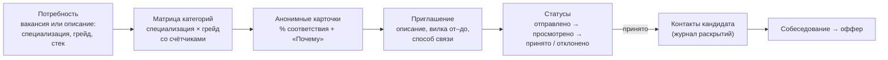

# Механика подбора и выхода на контакт

Смысловой центр продукта — **обратная механика**: инициативу проявляет работодатель. Он выбирает
категорию, видит анонимные карточки с объяснением соответствия и сам направляет приглашение
конкретному человеку — с описанием предложения и зарплатной вилкой. Отклик кандидата на вакансию
есть, но как дополнительный сценарий.

## 1. Путь работодателя

1. **Описание потребности.** Вакансия (или черновик) задаёт специализацию, грейд, стек, формат и
   вилку. По ней же система показывает пример теста — какие задания получат кандидаты.
2. **Подборка.** `GET /employer/catalog/categories` — матрица «специализация × грейд» с числом
   кандидатов (рамкой отмечены категории, рекомендованные под выбранную потребность: её грейд и
   соседние — те же, что получают баллы фактора «Категория»); `GET /employer/catalog/candidates` — карточки. Фильтры: категория, специализация, грейд,
   формат (кандидат может выбрать несколько), город из справочника (проходят и готовые к переезду),
   навыки (все указанные), только подтверждённые тестом, только с достижениями ФСП, категория ФСП,
   статус поиска. Фильтры меняют запрос, а не теряют подборку: выбранная вакансия и сортировка
   по соответствию сохраняются. Фильтры и выбранная потребность хранятся в адресе страницы, поэтому
   подборка не теряется при переходе по кабинету и кнопке «Назад», а ссылкой на неё можно поделиться.
3. **Приглашение без обязательной вакансии** (`POST /employer/applications`): должность, описание
   предложения, грейд, формат, город, вилка (обязательна, в рублях), способ связи; вакансия — по
   желанию (тогда поля заполняются из неё). Кандидат видит условия до начала общения.
4. **Статусы** видны обеим сторонам: `sent` → `viewed` (кандидат открыл список) → `accepted` /
   `declined`; ещё `withdrawn` (компания отозвала) и `expired` (14 дней без ответа). После отказа
   повторное приглашение той же компании — не раньше чем через 30 дней; одно открытое обращение на пару
   «компания — кандидат».
5. **Контакты** открываются только после согласия кандидата (принял приглашение или откликнулся сам):
   в момент согласия делается зашифрованный снимок имени и контактов, каждое раскрытие пишется в журнал.
6. **Дальше** — собеседование по принятому обращению и оффер с вилкой.

## 2. Ранжирование и объяснимость

Код: `backend/app/services/matching/` (паттерн Strategy — фактор = класс с весом и объяснением).

**Без вакансии — сила подтверждённого профиля внутри категории** (ТЗ: «выше те, у кого лучше
результаты тестирования и есть достижения ФСП»):

| Фактор | Вес | Что учитывает |
|---|---|---|
| Результат теста | 60 | баллы 0–100 внутри подтверждённой категории |
| Достижения ФСП | 25 | лучший уровень категорий ФСП (база / продвинутый / элита) |
| Актуальность | 15 | давность последней активности: тест, задача работодателя, профиль |

**Под вакансию — соответствие потребности** (сортировка каталога по умолчанию, если у компании есть вакансия):

| Фактор | Вес | Что учитывает |
|---|---|---|
| Категория | 30 | та же специализация; подтверждённый грейд совпал — 1, соседний — 0.5 |
| Результат теста | 20 | близость уровня по тесту к грейду вакансии (переквалифицированный подходит хуже точного) |
| Навыки | 20 | подтверждённые тестом — полностью, заявленные (и свои вне справочника — по названию) — наполовину |
| ФСП | 10 | подтверждённые достижения |
| Описание | 5 | общие темы описания вакансии и профиля (основы слов) |
| Актуальность | 5 | свежая активность |
| Формат и город | 5 | удалёнка, тот же город, готовность к переезду |
| Зарплата | 5 | ожидания в пределах вилки |

Самоописание (заявленные навыки, «о себе») весит мало: выдача строится на категории и тесте.
Каждый фактор возвращает понятную фразу — работодатель видит блок «Почему» в карточке: например,
«подтверждённый грейд Middle совпадает», «подтверждены тестом: Python; заявлены: Kafka».

Профиль без истории ФСП обрабатывается штатно: фактор ФСП даёт 0 с пояснением «навыки не подтверждены
ФСП», кандидат ранжируется по тесту и навыкам.

## 3. Как изменилась формула после оценки

Первая версия давала фактору теста «чем больше баллов, тем лучше» и под вакансию. Процедура оценки
([validation.md](validation.md)) показала, что так для вакансии Middle наверх выходят кандидаты уровнем
выше: Precision@10 было 53,8 % — ниже выдачи по резюме (58 %). Фактор теста под вакансию стал мерой
близости уровня к её грейду — Precision@10 выросла до 74,8 %, nDCG@10 — с 0,66 до 0,84. После того как
тест стал строиться по стеку кандидата, Precision@10 — 77,5 % против 64,8 % у выдачи по резюме.

## 4. Производительность

Рейтинг категории считается одним проходом и кэшируется на 60 с с версией каталога (число профилей и
время последнего изменения): изменение любого профиля сбрасывает кэш. Нагрузочный тест k6 — 420 запросов
в секунду, p95 73 мс на 4 процессах api (README, «Нагрузка и масштабирование»).

## 5. Конфиденциальность

- Работодатель видит анонимную карточку: идентификатор, категорию, навыки, тест, ФСП, город, формат;
  имя и контакты — только после согласия кандидата.
- Кандидат управляет видимостью: ожидания по зарплате, достижения ФСП и «о себе» можно скрыть —
  скрытое не участвует в подборе и не раскрывается.
- Статус «Не ищу» убирает профиль из каталога.
- Согласие на обработку и публикацию данных даётся при регистрации; его дата видна в настройках
  приватности (`GET /auth/me` → `consent_at`). Снять профиль с публикации — «Скрыть профиль от
  работодателей», отозвать согласие — удаление аккаунта (`POST /candidate/account/delete`).
